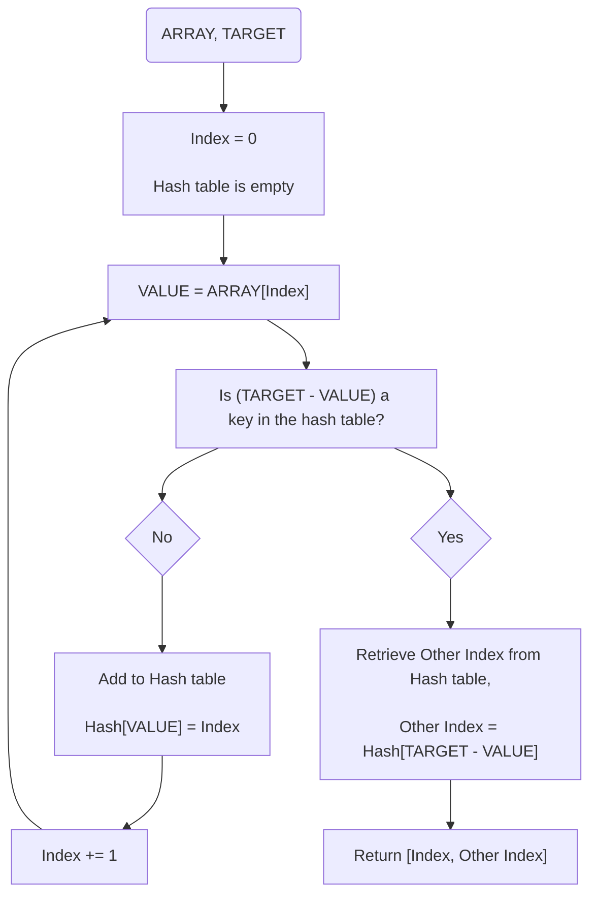
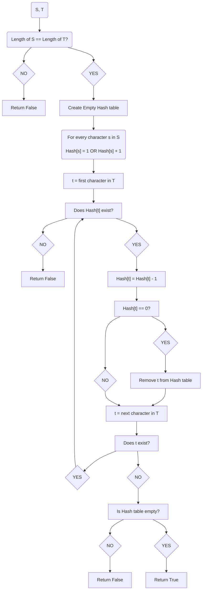
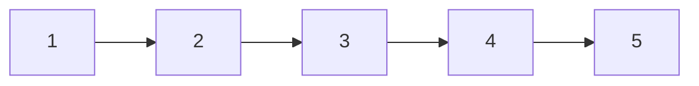
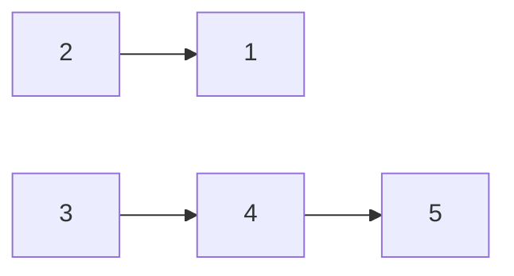
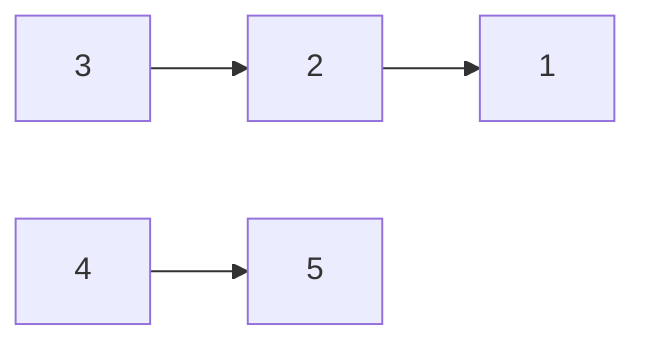
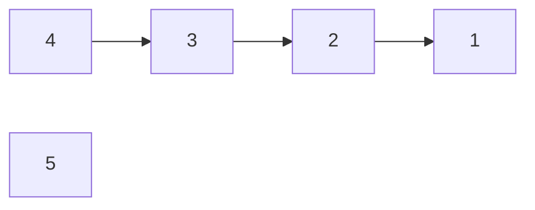
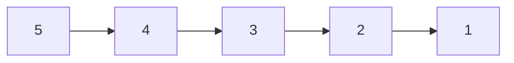
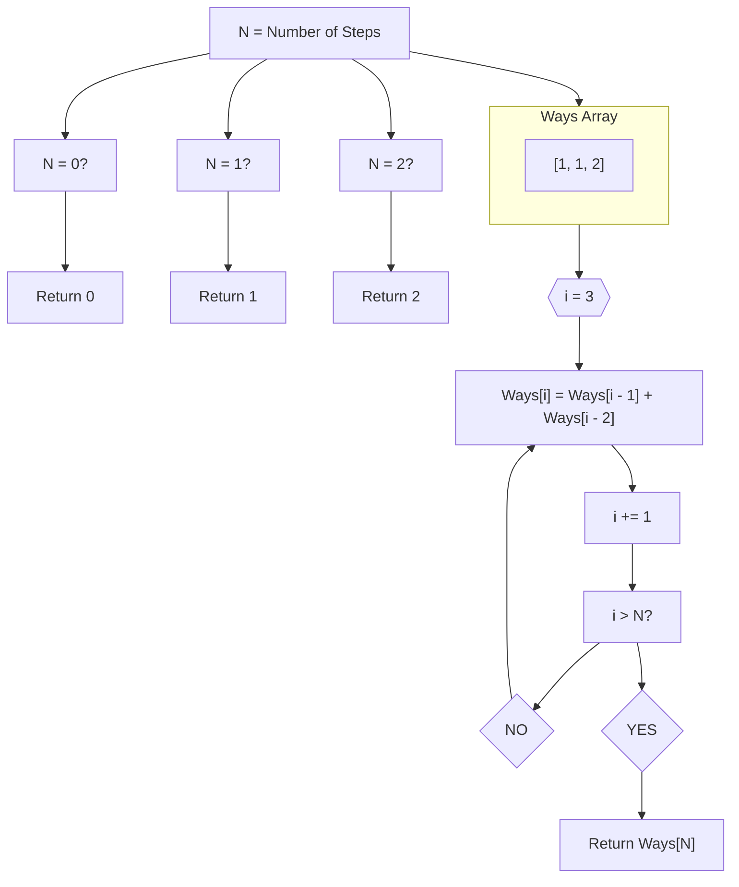

<h1 style="text-align:center">Learning Programming Languages Framework</h1>


![[code-stock-photo.jpg]]

<div style="page-break-after: always;"></div>

## Table of Contents

-   [[#Introduction]]
	- [[#Learning Programming Languages]]
	- Who this framework is for
	- How to use this framework
- Theory of programming languages
	- Introduction
		- Define what is meant by the "theory of programming languages"
		- Explain why understanding the theory of programming languages is important
		- Provide a brief overview of what will be covered in the chapter
	-   A Brief History of Programming Languages
		- Discuss the evolution of programming languages, from machine language to high-level languages
		- Highlight key programming languages and their contributions to the field
		- Explain how each generation of programming languages has built upon previous generations
	- The Anatomy of a Programming Language
		- Introduce the different components of a programming language, including syntax, semantics, and pragmatics
		- Explain the purpose of each component and how they work together to form a programming language
	- The Purpose of Programming Languages
		- Describe the different reasons for creating programming languages, such as solving specific problems, improving programmer productivity, and enhancing language capabilities
		- Discuss the tradeoffs that come with designing a programming language for a specific purpose
	- Types of Programming Languages
		- Introduce the different categories of programming languages, including procedural, object-oriented, functional, and scripting languages 
		- Explain the characteristics of each category and how they differ from one another
	- Language Paradigms
		- Introduce the different programming paradigms, including imperative, declarative, and event-driven programming
		- Explain how different programming languages implement these features and paradigms
	- Language Design and Implementation
		- Describe the process of designing and implementing a programming language, including the role of language designers, compilers, and interpreters
		- Discuss the challenges and tradeoffs involved in designing and implementing a programming language
	- Conclusion
		- Summarize the key points covered in the chapter
		- Reinforce the importance of understanding the theory of programming languages
		- Provide some resources for further learning on the topic
-   Hello World
	-   Set up local environment
	- Run simple "Hello World" program
	- Learn the syntax
- Algorithmic problems
	- Bitwise Addition
	- Reverse Link List
	- Climbing Stairs
	- Two Sum
	- Max Depth Of A Binary Tree
	- Valid Anagram
	-   Maximum Subarray
	- Valid Parentheses
	- Number Of Islands
-   Simple Projects

<div style="page-break-after: always;"></div>

## Introduction

### Learning Programming Languages

Programming languages are like tools in a toolbox, and just as a carpenter wouldn't rely on a single tool to build a house, a programmer shouldn't rely on a single language to develop software. Learning multiple programming languages can help you become a more versatile and well-rounded developer. Additionally, different languages are better suited for different tasks and projects, so knowing multiple languages can help you choose the best tool for the job.

Learning a new programming language can be a daunting task, even for experienced developers. Each language has its own syntax, rules, and quirks that can take time to master. Additionally, programming languages often have unique libraries and frameworks that require additional learning. One of the biggest challenges when learning a new language is figuring out how to apply the knowledge you already have to the new language, as well as how to think in the new language's paradigm.

Developing a consistent approach to learning a new programming language can help you learn more efficiently and effectively. By having a plan in place, you can identify what you need to learn and prioritize your learning. Additionally, a consistent approach can help you avoid getting bogged down in one particular area and ensure that you have a well-rounded understanding of the language.

Having a framework to learn new programming languages can provide structure and guidance when tackling a new language. A good framework will provide a roadmap for learning the language, covering topics such as syntax, data types, control structures, and libraries. Additionally, a framework can help you identify areas where you may be struggling and provide resources to help you overcome those challenges. By using a framework, you can learn new languages more efficiently and effectively, and add valuable skills to your developer tool kit.

### Who Should Use This Framework

#### Experienced Software Engineers

This framework is designed for experienced software engineers who are proficient in at least one programming language. Its goal is to help shorten the learning curve for new languages by building on the knowledge you already have and applying it to the new language.

Software engineers who already have experience with programming often find themselves asking, "How do I do X in programming language Y?" They know how to solve the problem and are searching for implementation details. This framework aims to help solve the same problems in multiple languages by spending less time thinking about how to solve the problem and more time understanding how to implement a solution in the new programming language.

#### Software Engineers Learning Their First Language

While junior software engineers are not the primary target audience, there may still be value in using this framework to learn your first programming language. However, it is assumed that you are already familiar with basic programming concepts and syntax such as variables, control structures, and basic data types. This allows the framework to focus on the syntax and unique features of a new language. If you are learning your first programming language, resources targeted for beginners such as Codecademy and Khan Academy can be helpful.

This framework provides a set of problems that emphasize problem-solving and algorithm development. Implementing the basic concepts can help solidify your understanding and is a valuable tool for gaining experience in solving problems programmatically, which is the most important skill for a software engineer to develop.

It is easy to feel overwhelmed when learning your first programming language because it seems like there is too much to learn. Many tutorials aimed at beginners quickly escalate by combining learning the language with learning a web framework, databases, version control, and more. While these are all important skills to learn, trying to learn them all at once is not the most beneficial approach for beginners.

The scope of the problems in this book is limited to the programming language itself. You need to be able to run programs in the programming language of your choice, and then you can focus on learning the language.

### How To Use This Framework

{TODO}

<div style="page-break-after: always;"></div>

## Theory of programming languages

### Introduction

Programming languages are the backbone of software development, and as a software engineer, it's essential to have a solid understanding of them. However, it's not just about knowing how to write code in a particular language; it's also about understanding the theory behind programming languages.

The theory of programming languages refers to the principles, concepts, and ideas that underpin the design and implementation of programming languages. It encompasses a broad range of topics, from the history of programming languages to the anatomy of a programming language, and from the different programming paradigms to the process of designing and implementing a programming language.

Understanding the theory of programming languages is crucial for several reasons. Firstly, it provides a foundation for learning new programming languages. By understanding the theory behind programming languages, you can identify patterns and similarities between different languages, which can help you learn new languages more quickly and easily.

Secondly, understanding the theory of programming languages can help you become a better software engineer. By having a deep understanding of programming languages, you can write more efficient and effective code, debug errors more easily, and create more robust and maintainable software.

In this chapter, we will provide a brief overview of the theory of programming languages. We'll start by discussing the history of programming languages and how they have evolved over time. We'll then delve into the anatomy of a programming language, including syntax, semantics, and pragmatics. Next, we'll explore the different purposes of programming languages and the tradeoffs that come with designing a language for a specific purpose. We'll then examine the different categories of programming languages and the features and paradigms that define them. Finally, we'll look at the process of designing and implementing a programming language.

By the end of this chapter, you will have a solid understanding of the theory of programming languages and the principles that underpin them. This knowledge will serve as a foundation for learning new programming languages and becoming a more effective software engineer.

<div style="page-break-after: always;"></div> 

### A Brief History of Programming Languages

Programming languages have come a long way since the first computer was invented. In the early days, programmers had to write code in machine language, which consisted of strings of binary digits that were interpreted by the computer's hardware. As you can imagine, this was a tedious and error-prone process.

Over time, programming languages evolved to become more user-friendly and accessible to programmers. The first high-level programming language was FORTRAN (FORmula TRANslation), which was developed in the 1950s. It was designed to simplify the process of writing mathematical formulas for scientific calculations.

Since then, many programming languages have been developed, each with their own unique features and purposes. Some of the most significant programming languages and their contributions to the field include:

**COBOL**: (Common Business-Oriented Language): Developed in the 1950s, COBOL was designed for business applications and is still used today in many financial and administrative systems.

**BASIC**: (Beginner's All-purpose Symbolic Instruction Code): Developed in the 1960s, BASIC was designed to make programming more accessible to beginners.

**C**: Developed in the 1970s, C was designed for system programming and is still widely used today for operating systems, device drivers, and embedded systems.

**Pascal**: Developed in the 1970s, Pascal was designed for teaching programming concepts and is still used in many computer science courses.

**C++**: Developed in the 1980s, C++ is an extension of the C language and introduced the concept of object-oriented programming, which is widely used today.

**Java**: Developed in the 1990s, Java was designed to be platform-independent, meaning that it could run on any operating system, and it introduced the concept of bytecode, which allows for more efficient code execution.

Each generation of programming languages has built upon previous generations, incorporating new features and capabilities while improving upon existing ones. For example, the first-generation languages (machine language and assembly language) were replaced by second-generation languages (FORTRAN, COBOL, and BASIC), which were then replaced by third-generation languages (C, Pascal, and Ada), which were in turn replaced by fourth-generation languages (SQL and scripting languages). Today, we have fifth-generation languages, which are designed for artificial intelligence and machine learning applications.

Understanding the evolution of programming languages can help us appreciate the complexity of modern software development and the contributions of the pioneers who made it all possible.

<div style="page-break-after: always;"></div>

### The Anatomy of a Programming Language

A programming language is made up of several different components that work together to define its structure and functionality. These components include syntax, semantics, and pragmatics.

#### Syntax

Syntax refers to the set of rules that define the structure and composition of a programming language. It includes elements such as keywords, operators, and punctuation that are used to construct code. The syntax of a programming language dictates how code is written and organized, and it is what allows programmers to communicate their ideas to the computer.

#### Semantics

Semantics refers to the meaning of a programming language. It defines how statements and expressions are interpreted by the computer and what they do when executed. Semantics determines the behavior of a program, and it is what allows programmers to create programs that perform specific tasks.

#### Pragmatics

Pragmatics refers to the way a programming language is used in practice. It encompasses issues such as code readability, maintainability, and efficiency. Pragmatics takes into account the goals of the programmer, the needs of the end-users, and the limitations of the system. It defines the best practices and conventions that programmers use to write high-quality code.

Together, syntax, semantics, and pragmatics form the foundation of a programming language. Syntax provides the rules for writing code, semantics provides the meaning behind the code, and pragmatics provides the context for how the code should be written and used.

Programming languages are designed to be expressive and flexible, allowing programmers to create a wide range of programs to meet different needs. The syntax, semantics, and pragmatics of a programming language work together to make this possible, providing a powerful tool for software development. By understanding the anatomy of a programming language, programmers can become more effective at writing code, debugging errors, and creating high-quality software.

<div style="page-break-after: always;"></div>

### The Purpose of Programming Languages

Programming languages are created for different reasons and serve different purposes. Here are some of the most common reasons for creating programming languages:

#### Solving Specific Problems

Some programming languages are designed to solve specific problems or address specific needs. For example, MATLAB was created for numerical computing, R was created for statistical computing, and SQL was created for working with databases.

#### Improving Programmer Productivity

Many programming languages are created with the goal of making programmers more productive. These languages often provide features such as higher-level abstractions, automated memory management, and garbage collection. Examples of languages designed to improve productivity include Python, Ruby, and JavaScript.

#### Enhancing Language Capabilities

Some programming languages are created to add new capabilities or features to existing languages. For example, C++ was created to add object-oriented programming to the C language, and C# was created to add features for Windows development.

While there are many benefits to creating new programming languages, there are also tradeoffs to consider. Some of these tradeoffs include:

#### Complexity

Creating a new programming language can be a complex and time-consuming process. It requires significant effort to design and implement a language that is both expressive and easy to use.

#### Adoption

Getting programmers to adopt a new programming language can be challenging. There is often a significant investment in learning and using a language, and it can be difficult to persuade programmers to switch to a new language.

#### Maintenance

Once a programming language is created, it needs to be maintained and updated over time. This can require a significant investment in resources and can be a challenge for smaller language communities.

Despite these challenges, programming languages continue to be created and evolve over time. They provide a powerful tool for software development, enabling programmers to solve complex problems and create innovative solutions.

<div style="page-break-after: always;"></div>

### Types of Programming Languages

Programming languages can be classified into different categories based on their design, syntax, and purpose. Here are some of the most common categories of programming languages:

#### Procedural Languages

Procedural languages are programming languages that are designed to execute a sequence of instructions, one after the other. Examples of procedural languages include C, Pascal, and FORTRAN. These languages are typically used for scientific and engineering applications, as well as for system programming.

#### Object-Oriented Languages

Object-oriented languages are programming languages that are designed to represent objects, which are instances of classes. Object-oriented programming allows for the creation of reusable code that can be easily maintained and extended. Examples of object-oriented languages include Java, C++, and Python.

#### Functional Languages

Functional languages are programming languages that treat computation as the evaluation of mathematical functions and avoid changing state and mutable data. They are based on the lambda calculus, a formal system for representing and manipulating functions. Examples of functional languages include Haskell, Lisp, and Scheme.

#### Scripting Languages

Scripting languages are programming languages that are designed to automate the execution of tasks. They are typically interpreted and can be used for a wide range of tasks, from simple scripts to complex applications. Examples of scripting languages include JavaScript, Perl, and Python.

Each category of programming languages has its own set of characteristics and advantages. Procedural languages are efficient and suitable for low-level programming, object-oriented languages are flexible and reusable, functional languages are concise and allow for high-level abstractions, and scripting languages are easy to use and versatile.

By understanding the different types of programming languages, programmers can choose the right language for the task at hand and develop a broader understanding of the field of software development.

<div style="page-break-after: always;"></div>

### Paradigms

Programming paradigms are different ways of structuring and executing programs. Each paradigm has its own set of principles and techniques that define how programs are written and organized. There are several programming paradigms, and each has its own strengths and weaknesses.

The reason there are multiple programming paradigms is that each one is designed to solve different types of problems. For example, imperative programming is good for low-level system programming and performance-critical applications, while declarative programming is good for data manipulation and query processing. Event-driven programming is good for user interface programming and real-time applications.

Here are some of the most common programming paradigms and their differences:

#### Imperative Programming

Imperative programming is a programming paradigm that focuses on describing how a program should perform a certain task. Programs in imperative languages are structured as sequences of statements that change the program state. Examples of imperative programming languages include C, C++, and Java.

#### Declarative Programming

Declarative programming is a programming paradigm that focuses on describing what a program should do. Programs in declarative languages specify the desired output and let the language's runtime environment figure out the details of how to compute the output. Examples of declarative programming languages include SQL, Prolog, and XSLT.

#### Functional Programming

Functional programming is a programming paradigm that emphasizes the use of functions to perform computations. Functions in functional languages do not have side effects and do not modify the program state. Examples of functional programming languages include Haskell, Lisp, and ML.

#### Object-Oriented Programming

Object-oriented programming is a programming paradigm that focuses on the use of objects to represent data and behavior. Objects are instances of classes, which are defined by their attributes and methods. Examples of object-oriented programming languages include Java, C++, and Python.

#### Event-Driven Programming

Event-driven programming is a programming paradigm that focuses on the use of events to control program flow. Programs in event-driven languages respond to user input or system events by executing code in response to those events. Examples of event-driven programming languages include JavaScript and Python.

Each programming paradigm has its own set of advantages and disadvantages. For example, imperative programming is good for low-level system programming and performance-critical applications, while declarative programming is good for data manipulation and query processing. Functional programming is good for mathematical and scientific computing, while object-oriented programming is good for large-scale software development. Event-driven programming is good for user interface programming and real-time applications.

Programmers choose the programming paradigm that best fits the problem they are trying to solve. They then use the language constructs and techniques specific to that paradigm to write code that is efficient, effective, and easy to maintain. By understanding the differences between programming paradigms, programmers can become more effective at choosing the right paradigm for the task at hand and writing code that is both efficient and effective.

Here's a reference table that summarizes some common programming paradigms, a brief description, strengths and weaknesses, and some examples of languages that use them:

<div style="page-break-after: always;"></div>

| Paradigm | Description                                                                                                                                                                                                                                                                                                                                                                    | Strengths                                                                                                                                                                                                                                                                                                                                                                                                                                                                                                                                                                                                                                                                                                                                                                                                                                                                                                                                                                                                                                                                                                                                                                                                                                                                                                    | Weaknesses                                                                                                                                                                                                                                                                                                                                                                                                                                                                                                                                                                                                                                                                                                                                                                                                                                                                                                                                                                                                                                                                                                                                                                                                                                                                                                   | Languages                                                                                                                         |
|----------------------|--------------------------------------------------------------------------------------------------------------------------------------------------------------------------------------------------------------------------------------------------------------------------------------------------------------------------------------------------------------------------------|----------------------------------------------------------------------------------------------------------------------------------------------------------------------------------------------------------------------------------------------------------------------------------------------------------------------------------------------------------------------------------------------------------------------------------------------------------------------------------------------------------------------------------------------------------------------------------------------------------------------------------------------------------------------------------------------------------------------------------------------------------------------------------------------------------------------------------------------------------------------------------------------------------------------------------------------------------------------------------------------------------------------------------------------------------------------------------------------------------------------------------------------------------------------------------------------------------------------------------------------------------------------------------------------------------------------------------------------------------------------------------------|-----------------------------------------------------------------------------------------------------------------------------------------------------------------------------------------------------------------------------------------------------------------------------------------------------------------------------------------------------------------------------------------------------------------------------------------------------------------------------------------------------------------------------------------------------------------------------------------------------------------------------------------------------------------------------------------------------------------------------------------------------------------------------------------------------------------------------------------------------------------------------------------------------------------------------------------------------------------------------------------------------------------------------------------------------------------------------------------------------------------------------------------------------------------------------------------------------------------------------------------------------------------------------------------------------------------------|---------------------------------------------------------------------------------|
| Imperative           | Focuses on describing how a program should be executed using statements that change the state of the program.                                                                                                                                                                                                                                                                     | Low-level control, easy to reason about and optimize performance.                                                                                                                                                                                                                                                                                                                                                                                                                                                                                                                                                                                                                                                                                                                                                                                                                                                                                                                                                                                                                                                                                                                                                                                                                                          | Code can be hard to read and maintain as the size of the program grows.                                                                                                                                                                                                                                                                                                                                                                                                                                                                                                                                                                                                                                                                                                                                                                                                                                                                                                                                                                                                                                                                                                                                                                                                                                       | C, Fortran, Pascal, BASIC, Assembly                                                                                                           |
| Object-Oriented      | Focuses on modeling real-world objects as software objects with attributes (data) and methods (behavior) that interact with each other.                                                                                                                                                                                                                                            | Encapsulation, abstraction, inheritance, and polymorphism. Allows for modularity, flexibility, and maintainability.                                                                                                                                                                                                                                                                                                                                                                                                                                                                                                                                                                                                                                                                                                                                                                                                                                                                                                                                                                                                                                                                                                                         | Can be more complex than other paradigms, and can be harder to learn.                                                                                                                                                                                                                                                                                                                                                                                                                                                                                                                                                                                                                                                                                                                                                                                                                                                                                                                                                                                                                                                                                                                                                                                                                                         | Java, Python, Ruby, C++, C#                                                                                                                  |
| Functional           | Focuses on describing what a program should do, rather than how it should do it, using functions to transform input data into output data, without modifying the input.                                                                                                                                                                                                            | No side effects, immutability, and compositionality. Results in code that is easier to reason about and test, and is less prone to bugs.                                                                                                                                                                                                                                                                                                                                                                                                                                                                                                                                                                                                                                                                                                                                                                                                                                                                                                                                                                                                                                                                                                             | Can be harder to debug, and some developers may not be used to thinking in terms of functions.                                                                                                                                                                                                                                                                                                                                                                                                                                                                                                                                                                                                                                                                                                                                                                                                                                                                                                                                                                                                                                                                                                                                       | Haskell, Lisp, Clojure, F#, Scala                                                                                                            |
| Declarative          | Focuses on describing the desired result, without specifying the steps to achieve it. The language runtime figures out the solution using abstractions provided by the language.                                                                                                                                                                                                   | Conciseness, expressiveness, and readability. Often results in less code and easier maintenance.                                                                                                                                                                                                                                                                                                                                                                                                                                                                                                                                                                                                                                                                                                                                                                                                                                                                                                                                                                                                                                                                                                                                    | Can be less efficient than other paradigms, and may require a good understanding of the underlying language runtime.                                                                                                                                                                                                                                                                                                                                                                                                                                                                                                                                                                                                                                                                                                                                                                                                                                                                                                                                                                                                                                                                                                                    | SQL, Prolog, Haskell                                                                                                                          |
| Event-Driven         | Focuses on reacting to external events, such as user input or network activity. The program waits for events to occur and then responds to them with appropriate actions.                                                                                                                                                                                                        | Scalability, responsiveness, and modularity. Useful for applications that involve user interaction, I/O operations, or network communication.                                                                                                                                                                                                                                                                                                                                                                                                                                                                                                                                                                                                                                                                                                                                                                                                                                                                                                                                                                                                                                                                                          | Can be harder to reason about than other paradigms, and can lead to race conditions and other concurrency issues.                                                                                                                                                                                                                                                                                                                                                                                                                                                                                                                                                                                                                                                                                                                                                                                                                                                                                                                                                                                                                                                                                                                      | JavaScript, Python, C#                                                                                                                       |
| Logic                | Focuses on describing the problem domain as a set of rules or constraints, and using logical inference to find a solution.                                                                                                                                                                                                                                                         | Good for problems that can be described in terms of rules or constraints. Can be used for AI, expert systems, and automated reasoning.                                                                                                                                                                                                                                                                                                                                                                                                                                                                                                                                                                                                                                                                                                                                                                                                                                                                                                                                                                                                                                                                                                    | Can be inefficient and computationally expensive, especially for large problems. May require a good understanding of logic and inference mechanisms. | Prolog, Mercury, Datalog | 
| Concurrent | Focuses on managing multiple threads or processes that run concurrently, often using shared memory or message passing to communicate. | Scalability, responsiveness, and efficiency. Useful for applications that involve parallel processing, I/O operations, or network communication. | Can be harder to reason about than other paradigms, and can lead to race conditions and other concurrency issues. Can also be harder to debug and test. | Go, Erlang, Rust |
<div style="page-break-after: always;"></div>
### Language Design and Implementation

Designing and implementing a programming language is a complex process that involves multiple steps and stakeholders. Here are some of the key elements involved in the process:


#### Language Designers
Language designers are responsible for defining the syntax and semantics of a programming language. They need to consider factors such as ease of use, expressiveness, and performance when designing the language. The design process typically involves creating a language specification that describes the language's syntax, semantics, and features.

#### Compilers and Interpreters

Compilers and interpreters are tools used to translate code written in a programming language into machine-readable code. Compilers translate code into machine code before execution, while interpreters translate code into machine code during execution. Both compilers and interpreters play an important role in implementing programming languages.

#### Implementation

Implementing a programming language involves creating a compiler or interpreter for the language. This process involves creating a parser that can recognize the syntax of the language, creating a symbol table to track variables and functions, and generating code that can be executed by a computer.

The process of designing and implementing a programming language comes with several challenges and tradeoffs. Here are some of the most common challenges:

#### Performance

Designing a language that is both expressive and performant is a significant challenge. Language designers need to balance the need for expressive features with the need for performance. For example, allowing arbitrary code execution in a language may make it more expressive, but it can also make the language less secure and less performant.

#### Ease of Use

Designing a language that is easy to use and learn is important for attracting new users. Language designers need to consider factors such as readability, simplicity, and consistency when designing the language.

#### Adoption

Getting programmers to adopt a new programming language can be challenging. There is often a significant investment in learning and using a language, and it can be difficult to persuade programmers to switch to a new language. Language designers need to create a language that is compelling enough to persuade programmers to switch.

#### Maintenance

Once a programming language is created, it needs to be maintained and updated over time. This can require a significant investment in resources and can be a challenge for smaller language communities.

One example of language design and implementation is the development of the Rust programming language. Rust was designed with the goal of being a safe and performant systems programming language. The language was designed to provide low-level control over system resources while also providing high-level abstractions that make it easier to write safe and correct code. Rust has a unique ownership system that ensures memory safety and prevents common programming errors such as null pointer dereferencing. The language was implemented using a compiler that translates Rust code into efficient machine code. Rust has gained popularity in recent years and is used in a wide range of applications, including web development, systems programming, and game development.

By understanding the process of language design and implementation, programmers can gain a deeper appreciation for the nuances and complexities of programming languages. They can also gain insight into the tradeoffs and challenges involved in designing and implementing programming languages, which can help them make better decisions when choosing a language for a particular task.

<div style="page-break-after: always;"></div>

### Conclusion

In this chapter, we have explored the theory of programming languages and why it is important for software engineers to understand it. We have discussed the evolution of programming languages, the different categories of programming languages, and the various language features and paradigms. We have also discussed the process of language design and implementation and the challenges and tradeoffs involved in creating programming languages.

Understanding the theory of programming languages is essential for software engineers of all levels of experience. By understanding the underlying principles and techniques of programming languages, engineers can make better decisions when choosing a language for a particular task. They can also write more efficient, effective, and maintainable code.

To continue learning about the theory of programming languages, there are several resources available. Online courses and tutorials can provide a comprehensive overview of programming language concepts and principles. Reading academic papers and books on programming languages can also provide deeper insights into the theory of programming languages.

In conclusion, understanding the theory of programming languages is a critical skill for software engineers. By understanding the different categories of programming languages, language features, and paradigms, and the process of language design and implementation, engineers can become more effective at choosing the right language for the task at hand and creating efficient, effective, and maintainable code.
<div style="page-break-after: always;"></div>
Here are some resources for further learning about the theory of programming languages:

1.  "Programming Languages, Part A" on Coursera - This online course from the University of Washington provides an in-depth overview of programming language concepts and principles.
    
2.  "The Design of Everyday Programs" by Matthias Felleisen - This book provides a comprehensive introduction to programming language design and implementation.
    
3.  "Essentials of Programming Languages" by Daniel P. Friedman and Mitchell Wand - This book provides a comprehensive introduction to programming language concepts and principles.
    
4.  "Programming Language Pragmatics" by Michael L. Scott - This book provides a comprehensive overview of programming language concepts and principles, with a focus on practical applications.
    
5.  "The Art of Computer Programming" by Donald E. Knuth - This classic book provides a comprehensive overview of computer programming concepts and principles.
    
6.  "Structure and Interpretation of Computer Programs" by Harold Abelson and Gerald Jay Sussman - This book provides a comprehensive introduction to programming language concepts and principles, with a focus on the Scheme programming language.
    
7.  "Concepts, Techniques, and Models of Computer Programming" by Peter Van Roy and Seif Haridi - This book provides a comprehensive overview of programming language concepts and principles, with a focus on the Oz programming language.
    
8.  "Types and Programming Languages" by Benjamin C. Pierce - This book provides a comprehensive overview of programming language type systems.
    
9.  "Programming Language Foundations" on edX - This online course from the University of Washington provides an in-depth introduction to programming language concepts and principles.
    
10.  "Principles of Programming Languages" on Udacity - This online course provides an introduction to programming language concepts and principles, with a focus on functional programming.

<div style="page-break-after: always;"></div>

## Hello World

In this chapter, you will write a "Hello, World!" program. This simple program is often the first thing that programmers learn to write in a new language, and for good reason: it's a quick and easy way to test that your development environment is set up correctly, and it gives you a sense of accomplishment as you start your journey to learning a new programming language.

The specific details on how to do this will depend on your development environment. There is no one size fits all when it comes to development environments. You may choose to set up your environment on your local machine, and the details will depend on your operating system and favorite code editor. Or you may choose to use a cloud based service like AWS Cloud 9.

Running a program on your local machine provides full control and customization of the development environment, as well as potentially faster performance and reduced latency. It does not require reliance on an internet connection or external service, and provides easier access to local resources such as files and databases. However, setting up and maintaining the development environment can be time-consuming, and there may be compatibility issues with different operating systems and hardware configurations. Additionally, collaboration with others in real-time may be more difficult.

Using a cloud-based service like AWS Cloud9 offers quick and easy setup of a development environment, easy collaboration with others in real-time, and access to powerful cloud-based resources and services. It also provides a consistent environment across multiple devices and locations. However, there is a dependency on an internet connection and external service, and potential latency and slower performance compared to a local machine. Additionally, the development environment may be less customizable, and there may be potential security and privacy concerns when working with sensitive data.

For this initial program, you want to remember to keep it simple. You want to run a simple program in the development environment that you are most comfortable with. Try to avoid rabbit holes like researching all of the best VSCode plugins. This can be optimized later after you have some experience writing code with the language.

This should be your focus:
- Choose the development environment that works for you
- Install the programming language in your development environment
- Run a simple "Hello World!" program

{
TODO: 
ChatGPT prompt here for specific instructions on your environment
https://chat.openai.com/c/cbf63450-246b-4906-a34d-8f1120f0682a
Can you write a detailed how to guide that explains everything I need to do to install {programming language} on {development environment} and run a simple hello world program? Please detail exactly where to go for any downloads
}


The program you create should do the following:
- print "Hello World!"
<div style="page-break-after: always;"></div>

<div style="page-break-after: always;"></div>

## Algorithm Problems

Algorithm problems are a great way to learn a new programming language, as they allow you to practice using the language's syntax and features in a structured and challenging way.

This chapter provides a curated list of algorithm problems to use a combination of data structures. You will gain hands-on experience with the programming language you're learning and build your confidence and proficiency with the language's syntax, features, and data structures.

{#TODO
Describe the curated problems
  - from the list of 75 top algorithm problems
  - data structures and concepts covered
  - structure for each problem
  - how to get fast feedback from leetcode
}

Learning how to solve algorithm problems is a skill set of its own, especially if you are preparing for interviews. Because the focus is on learning a new programming language, pseudo code solutions are provided for each problem. This is to allow you to spend more of your time focusing on syntax and data structures and less time on problem solving.

{#TODO
  Plug algomonster as the best place to learn how to solve programming problems for tech interviews
}

As you continue to learn more languages, 

[LeetCode](https://leetcode.com/) is an online platform that offers a collection of coding challenges designed to help programmers improve their problem-solving skills and prepare for technical interviews. The LeetCode platform includes a wide range of problems, from basic data structures and algorithms to advanced programming topics such as machine learning and computer vision.

Each problem on LeetCode is accompanied by a set of test cases that a programmer's code must pass in order to be considered correct. The platform also offers solutions and explanations for each problem, as well as a discussion forum where users can ask and answer questions related to the problems.

<div style="page-break-after: always;"></div>

### Two Sum

LeetCode Difficulty: **Easy**
[LeetCode Link](https://leetcode.com/problems/valid-anagram/)

#### Problem

*Given an array of integers and an integer target, return indices of the two numbers such that they add up to target.*

*You may assume that each input would have exactly one solution, and you may not use the same element twice.*

*You can return the answer in any order.*

**Example**

```
Input: [1,4,2,5], 7
Output: [2,3]
```

**Pseudocode Solution**

1. Create a function called that takes an array of integers and a target integer as inputs.

2. Initialize an empty hash table.
   
3. Loop through the input array with index and value and do the following for each element:
   a. Calculate the difference between the target and the current value, call it required_value.
   b. Check if required_value is in the hash table:
      i. If it is, return the index stored in the hash table for required_value and the current index.
   c. If required_value is not in the hash table, store the current value as a key and its index as a value in the hash table.

4. If the loop finishes without finding a solution, return a message indicating that there is no solution.





<div style="page-break-after: always;"></div>

## Valid Anagram


LeetCode Difficulty: **Easy**
[LeetCode Link](https://www.notion.so/frankdelpidio/Array-40a6f920e75a454f8fb4e03c34dcb019?pvs=4)

#### Problem

*Given two strings s and t, return true if t is an anagram of s, and false otherwise.*

*An Anagram is a word or phrase formed by rearranging the letters of a different word or phrase, typically using all the original letters exactly once.*

**Example**

```
Input: s = "anagram", t = "nagaram"
Output: True

Input: s = "anagram", t = "hotdogs"
Output: False
```

**Pseudocode Solution**

1.  Create a function that takes two strings, s and t, as inputs.
2.  Check if the lengths of s and t are equal: 
		a. If they are not equal, return false because they cannot be anagrams.
3.  Initialize an empty dictionary called letter_count.
4.  Loop through each character in string s, do the following: a. If the character is in letter_count, increment its value by 1. b. If the character is not in letter_count, add it to the dictionary with a value of 1.
5.  Loop through each character in string t, do the following: a. If the character is not in letter_count, return false because it is not an anagram. b. If the character is in letter_count, decrement its value by 1. c. If the value of the character in letter_count becomes 0, remove the character from the dictionary.
6.  If the dictionary letter_count is empty after the loops, return true because t is an anagram of s.
7.  If the dictionary letter_count is not empty, return false because t is not an anagram of s.



<div style="page-break-after: always;"></div>

## Reverse Linked List


LeetCode Difficulty: **Easy**
[LeetCode Link](https://leetcode.com/problems/reverse-linked-list/)

#### Problem

	Given the head of a singly linked list, reverse the list, and return the reversed list.

**Example**

```
Input: head = [1,2,3,4,5]
Output: [5,4,3,2,1]
```

**Pseudocode Solution**

1. Define Node pointer "previous" and initialize it to null
2. Define Node pointer "current" and set it to the head of the list
3. Define Node pointer "next"
4. Loop "while current node is not null":
5.     Set "next" to be the next node of "current"
6.     Change the next of the "current" node to point to the "previous"
7.     Move the "previous" and "current" pointers one step forward: 
	    - Set "previous" to be "current"
	    - Set "current" to be "next"
8. End loop
9. At the end of the list, "previous" will be pointing to the new head (or the last node of the original list). So, return "previous" as the head of the reversed list.


`Curr` = 1
`Prev` = Null
`Next` = 2


---

`Curr` = 2
`Prev` = 1
`Next` = 3


---
`Curr` = 3
`Prev` = 2
`Next` = 4


---
`Curr` = 4
`Prev` = 3
`Next` = 5


---
`Curr` = 5
`Prev` = 4
`Next` = Null


---
`Curr` = Null
`Prev` = 5
`Next` = Null

<div style="page-break-after: always;"></div>


## Climbing Stairs

LeetCode Difficulty: **Easy**
[LeetCode Link](https://leetcode.com/problems/climbing-stairs/)

#### Problem

*You are climbing a staircase. It takes `n` steps to reach the top.*

*Each time you can either climb `1` or `2` steps. In how many distinct ways can you climb to the top?*

**Example**

```
Input: n = 2
Output: 2

Explanation: There are two ways to climb to the top.
1. 1 step + 1 step
2. 2 steps
```

**Pseudocode Solution**
1. Define the function `CountWaysToClimb(n)` where `n` is the number of steps.
2. If `n` is 0, return 0.
3. If `n` is 1, return 1.
4. If `n` is 2, return 2.
5. Create an array, `ways`, of size `n+1` with each entry initialized to 0.
6. Set `ways[0]` to 1, this is because there is 1 way to climb 0 steps.
7. Set `ways[1]` to 1, this is because there is 1 way to climb 1 step.
8. Set `ways[2]` to 2, this is because there are 2 ways to climb 2 steps.
9. For each integer `i` from 3 to `n`:
    - Set `ways[i]` to `ways[i-1] + ways[i-2]`. 
	    - This is because the number of ways to get to step `i` is the sum of the number of ways to get to the previous step and the step before that.
10. Return `ways[n]` which is the number of distinct ways to climb `n` steps.
11. End of the function `CountWaysToClimb(n)`.




<div style="page-break-after: always;"></div>
## Valid Parentheses

LeetCode Difficulty: **Easy**
[LeetCode Link](https://leetcode.com/problems/valid-parentheses/)

#### Problem

*Given a string s containing just the characters `(`, `)`, `{`, `}`, `[` and `]`, determine if the input string is valid.*

*An input string is valid if:*

*Open brackets must be closed by the same type of brackets.*
*Open brackets must be closed in the correct order.*
*Every close bracket has a corresponding open bracket of the same type.*

**Example**

```
Input: s = "()[]{}"
Output: true

Input: s = "(]"
Output: false
```

**Pseudocode Solution**

1. `Create` an empty stack, call it `bracketStack`.
2. `Define` a dictionary `brackets` where each key is a closed bracket and each value is its corresponding opening bracket. 
	- `'}': '{'` 
	- `')': '('` 
	- `']': '['`.

3. `For` each character `c` in the input string `s`, `do` the following:
    - `If` `c` is an opening bracket (i.e., `c` is in the values of `brackets`), `then`:
        - `Push` `c` onto `bracketStack`.
    -  `Else If` `c` is a closing bracket (i.e., `c` is in the keys of `brackets`), `then`:
	- `If` `bracketStack` is empty `or` the top of the `bracketStack` is not equal to the opening bracket corresponding to `c` (i.e., `brackets[c]`), `then`:
		- `Return` false.
	- `Else`:
		- `Pop` the top element from `bracketStack`.

4. `After` iterating through the string:
	- `If` `bracketStack` is empty, `then`
		- `Return` true.
	- `Else`
		- `Return` false.

![[valid_parentheses.png]]


<div style="page-break-after: always;"></div>

## Maximum Subarray

LeetCode Difficulty: **Medium**
[LeetCode Link](https://leetcode.com/problems/maximum-subarray/)

#### Problem

*Given an integer array `nums`, find the subarray with the largest sum, and return its sum.*

**Example**

```
Input: nums = [-2,1,-3,4,-1,2,1,-5,4]
Output: 6
Explanation: The subarray [4,-1,2,1] has the largest sum 6.
```

```
Input: nums = [1]
Output: 1
Explanation: The subarray [1] has the largest sum 1.
```

```
Input: nums = [5,4,-1,7,8]
Output: 23
Explanation: The subarray [5,4,-1,7,8] has the largest sum 23.
```

**Pseudocode Solution**

1.  Initialize a variable `currentSum` to 0. This variable will keep track of the sum of the current subarray.
2.  Initialize a variable `maxSum` to negative infinity. This variable will keep track of the maximum sum found so far.
3.  Start a loop to traverse over each element in the array `nums`.
    1.  For each element `nums[i]` do the following:
        1.  Update `currentSum` to the maximum of (`currentSum` + `nums[i]`) and `nums[i]`.
        2.  Update `maxSum` to the maximum of `maxSum` and `currentSum`.
4.  After the loop ends, `maxSum` will hold the maximum subarray sum, so return `maxSum`.

![[maximum_subarray.png]]


<div style="page-break-after: always;"></div>
## Maximum Depth Of A Binary Tree

LeetCode Difficulty: **Medium**
[LeetCode Link](https://leetcode.com/problems/maximum-subarray/)

#### Problem

*Given the `root` of a binary tree, return its maximum depth.*

*A binary tree's maximum depth is the number of nodes along the longest path from the root node down to the farthest leaf node.*

**Example**

```
Input: root = [3,9,20,null,null,15,7]
Output: 3
```

```
Input: root = [1,null,2]
Output: 2
```

**Pseudocode Solution**

1.  Define a function `maxDepth` that takes a binary tree root node as its input.
2.  Inside `maxDepth`, first check if the root node is `null`. If it is, return 0. This step is your base case and it takes care of empty trees or when you've traversed to a non-existing child of a leaf node.
3. If the root is not `null`, recursively call `maxDepth` for the left and right child nodes of the root.
4. Since we need to find the maximum depth, compare the depth of the left subtree and the right subtree. Choose the larger one and add 1 to it (which accounts for the root of the current tree/subtree). This is the depth of the tree rooted at the current node.
5. Return `currentMaxDepth` from the `maxDepth` function.