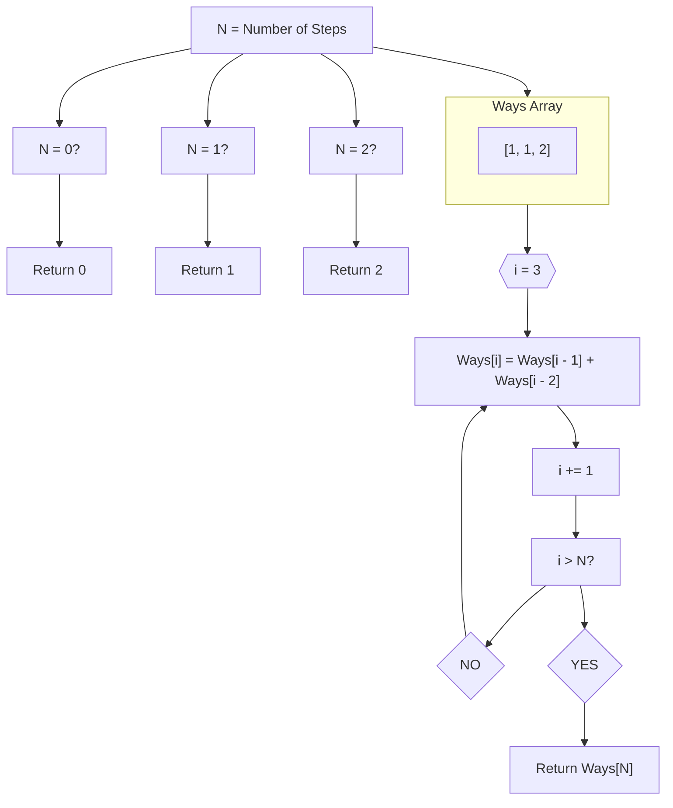

```mermaid

graph TD

N[N = Number of Steps]

N0[N = 0?]

N1[N = 1?]

N2[N = 2?]

R0[Return 0]

R1[Return 1]

R2[Return 2]

DP{{" i = 3"}}

NS["Ways[i] = Ways[i - 1] + Ways[i - 2]"]

II[i += 1]

X[i > N?]

NO{NO}

YES{YES}

RES["Return Ways[N]"]

  

subgraph WA[Ways Array]

direction LR

0["[1, 1, 2]"]

end

  
  

N --> N0

N --> N1

N --> N2

N0 --> R0

N1 --> R1

N2 --> R2

N --> WA

WA --> DP

DP --> NS

NS --> II

II --> X

X --> NO

X --> YES

NO --> NS

YES --> RES

```
