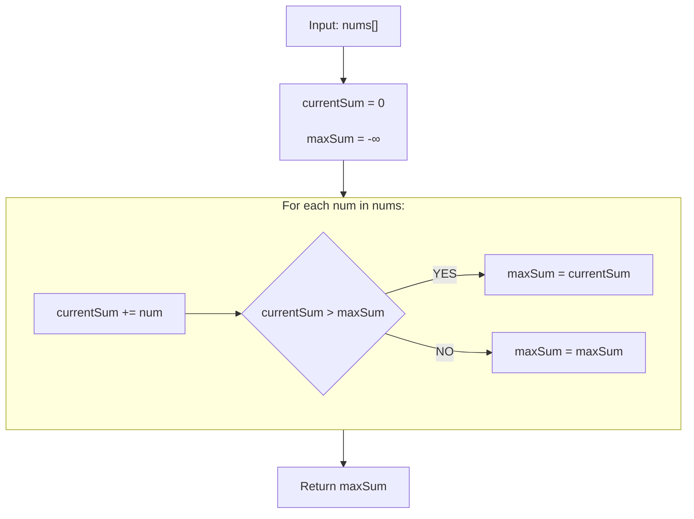

```mermaid

flowchart TB

Start["Input: nums[]"]

Initialize["currentSum = 0

maxSum = -#8734;"]

Res[Return maxSum]

  

subgraph Loop[For each num in nums:]

CSUM["currentSum += num"]

MSUMCHECK{currentSum > maxSum}

MSUM["maxSum = currentSum"]

MSUM2["maxSum = maxSum"]

  

CSUM --> MSUMCHECK

MSUMCHECK -- YES --> MSUM

MSUMCHECK -- NO --> MSUM2

end

  

Start --> Initialize

Initialize --> Loop

Loop --> Res

```
