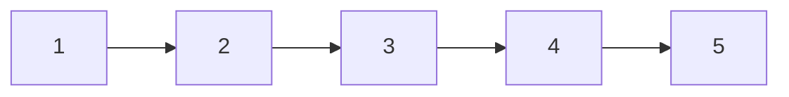
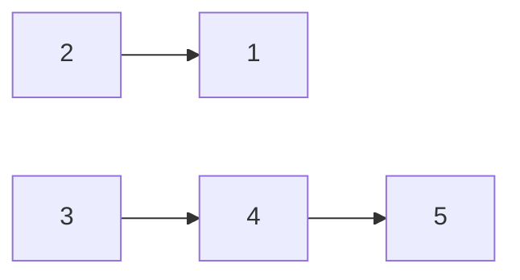
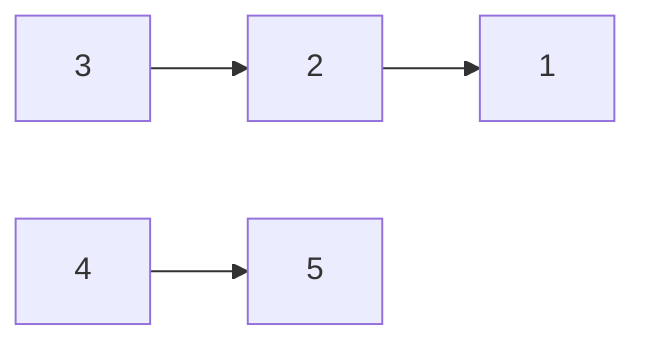
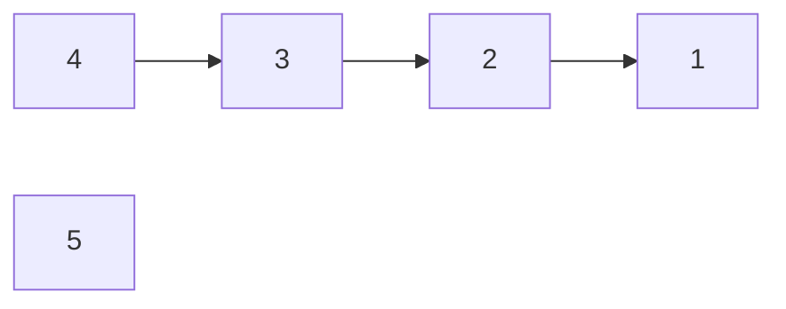
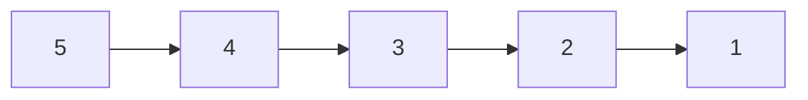

`Curr` = 1
`Prev` = Null
`Next` = 2

---

`Curr` = 2
`Prev` = 1
`Next` = 3

---
`Curr` = 3
`Prev` = 2
`Next` = 4

---
`Curr` = 4
`Prev` = 3
`Next` = 5

---
`Curr` = 5
`Prev` = 4
`Next` = Null

---
`Curr` = Null
`Prev` = 5
`Next` = Null
