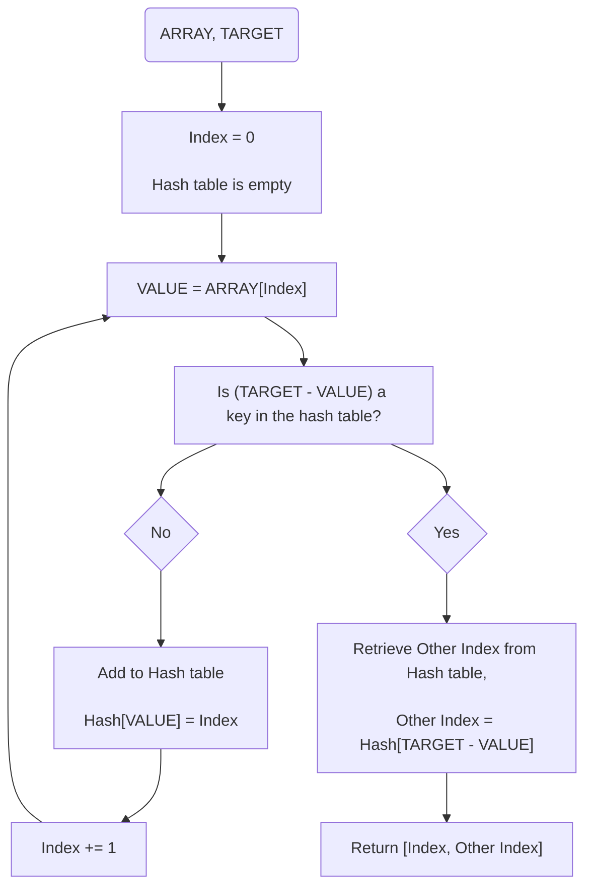

```mermaid

flowchart TD

A(ARRAY, TARGET)

B["Index = 0

Hash table is empty"]

C["VALUE = ARRAY[Index]"]

D["Is (TARGET - VALUE) a key in the hash table?"]

I{No}

J{Yes}

E["Add to Hash table

Hash[VALUE] = Index"]

F[Index += 1]

G["Retrieve Other Index from Hash table,

Other Index = Hash[TARGET - VALUE]"]

H["Return [Index, Other Index]"]

  
  

A --> B

B --> C

C --> D

D --> I

I --> E

E --> F

F --> C

D --> J

J --> G

G --> H

  

```

