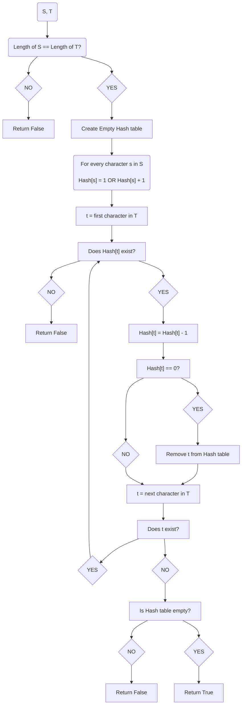

```mermaid

flowchart TD

  

A(S, T)

B(Length of S == Length of T?)

C{NO}

D{YES}

E[Return False]

F[Create Empty Hash table]

G("For every character s in S

Hash[s] = 1 OR Hash[s] + 1")

H["t = first character in T"]

I["Does Hash[t] exist?"]

J{NO}

E2[Return False]

K{YES}

L["Hash[t] = Hash[t] - 1"]

M["Hash[t] == 0?"]

N{NO}

O{YES}

P[Remove t from Hash table]

Q[Does t exist?]

R{YES}

S{NO}

T[t = next character in T]

U[Is Hash table empty?]

V{NO}

W{YES}

E3[Return False]

X[Return True]

  

A --> B

B --> C

B --> D

C --> E

D --> F

F --> G

G --> H

H --> I

I --> K

I --> J

J --> E2

K --> L

L --> M

M --> N

M --> O

O --> P

P --> T

N --> T
T --> Q

Q --> R

Q --> S

R --> I

S --> U

U --> V

U --> W

V --> E3

W --> X

```
