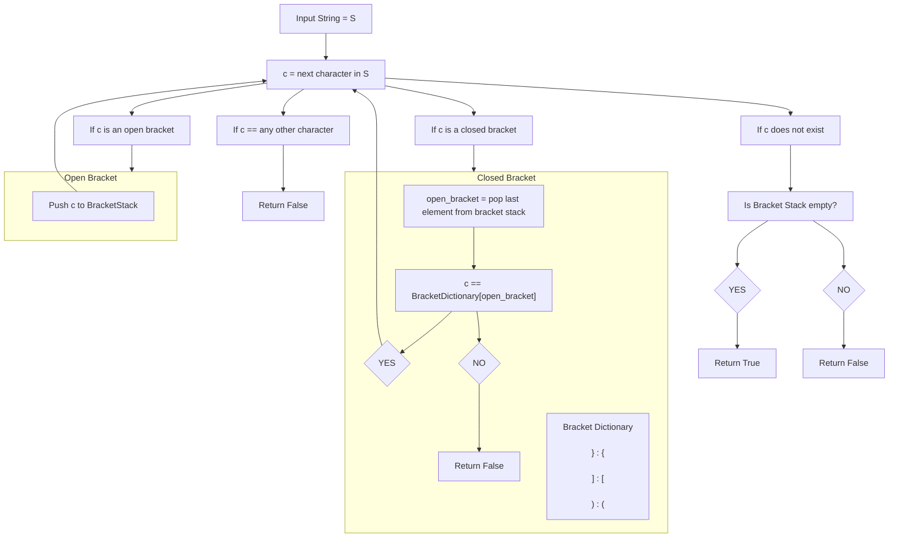

```mermaid

graph TD

S["Input String = S"]

FC["c = next character in S"]

COPEN["If c is an open bracket"]

CCLOSE["If c is a closed bracket"]

COTHER["If c == any other character"]

RF[Return False]

CNULL["If c does not exist"]

BSEMPTY["Is Bracket Stack empty?"]

BSYES{YES}

BSNO{NO}

RT[Return True]

BSF[Return False]

  

subgraph ClosedBracket["Closed Bracket"]

direction TB

CB1["open_bracket = pop last element from bracket stack"]

CB2["c == BracketDictionary[open_bracket]"]

CBYES{YES}

CBNO{NO}

CBRF[Return False]

BRA["Bracket Dictionary

} : {

] : [

) : (

"]

  

CB1 --> CB2

CB2 --> CBYES

CB2 --> CBNO

CBNO --> CBRF

end

  
  

subgraph OpenBracket[Open Bracket]

direction LR

OBN[Push c to BracketStack]

end

  

S --> FC

FC --> COPEN

FC --> CCLOSE

FC --> COTHER

FC --> CNULL

CCLOSE --> ClosedBracket

COPEN --> OpenBracket

COTHER --> RF

CBYES --> FC

OBN --> FC

CNULL --> BSEMPTY

BSEMPTY --> BSYES

BSEMPTY --> BSNO

BSYES --> RT

BSNO --> BSF

```
